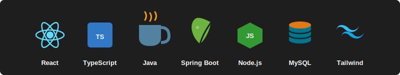

<h1 align="center">RMKode</h1>

  

  Engineering scalable digital platforms.

---

## About

RMKode is a technology startup focused on building scalable, high-performance digital platforms using modern full-stack technologies.

We prioritize clean architecture, long-term maintainability, and performance-driven development.

---

## Core Stack

- React
- TypeScript
- Spring Boot
- Node.js
- PostgreSQL
- Tailwind CSS

  

---

## Engineering Principles

- Modular architecture
- Strong typing and code quality
- Scalable backend infrastructure
- Performance-oriented frontend development

---

## Featured Projects

- Project Alpha: Scalable web platform using React and Node.js
- Project Beta: Backend API with Spring Boot and PostgreSQL
- Project Gamma: Mobile-first application with TypeScript

---

  
  
  

